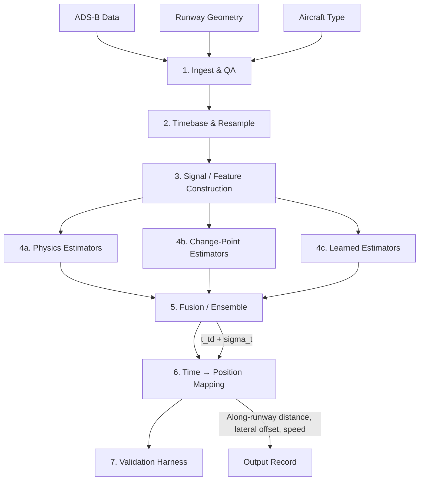

# Design Document

> **Revision v1.1 — review changes incorporated.** Key technical decisions expanded; added Module 1b (trajectory classification + flag-independent coarse bracket); geoid/datum unification in ingest; extended-region glideslope+flare fit; pitch-resolved lever-arm geometry (X·cosθ + V·sinθ) with class-median missing-default; `SourceCapability` gating (FR24 assumed barometric-only/interpolated); cross-correlation clock alignment with clock-independent distance truth; tail-grouped split + separate held-out-airport/runway + calibration split; new data-model fields (RunwayReference datum/width, LeverArm pitch/class, TouchdownResult trajectory_type and gating flags); corrected Property 2 (height term), Property 10 (split), Property 11 (reproducibility); new Properties 19–23; new failure codes; added edge-case and property tests.

## Overview

This design describes a **batch-mode offline system** that infers aircraft touchdown time and along-runway position from ADS-B surveillance data, validated against 40,500 QAR-matched flights. The system estimates sub-sample touchdown time (`t_td`) from coarse 4–5 second ADS-B updates, maps that time to an along-runway distance from threshold, and quantifies uncertainty — enabling identification of long-landing and high-speed-touchdown operational hazards for runway excursion/overrun risk analysis.

### Design Philosophy

Three commitments shape the architecture:

1. **Estimate a time, then map to a place.** Touchdown falls between ADS-B samples. Every estimator targets a sub-sample touchdown time; the horizontal position is obtained afterward by interpolating the trajectory at that time and projecting onto the runway. This cleanly separates detection from geolocation.

2. **Physics for trust, learning for accuracy.** A deep sequence model is expected to be the most accurate estimator, but safety analysis requires explainability. The design always pairs the learned estimator with an interpretable physical anchor, and feeds physics-derived signals into the learned model so it refines physics rather than rediscovering it.

3. **Multiple estimators, calibrated fusion.** Methods fail on different landings (null vertical rate, geometric-altitude bias, long/balked flares, source quirks). An ensemble calibrated on QAR reduces variance and, crucially, the long-landing tails that drive overrun risk.

### Key Technical Decisions

| Decision | Rationale |
|----------|-----------|
| Separate timestamps preserved (no naive merge) | At 130 kt and 2 s offset, merging injects ~130 m error — comparable to the quantity being estimated |
| Segmented regression on raw groundspeed for the primary decel estimate | Differentiate-then-detect forces a smoothing window that blurs the very breakpoint being located; fitting segments to the raw signal avoids that trade-off |
| Smoothed derivatives (Savitzky-Golay / GP) only for corroborating signals | Raw finite differencing at 4–5 s cadence makes jerk nearly pure noise; GP/SavGol must be non-stationary/piecewise so the knee isn't over-smoothed |
| Soft Gaussian labels for sequence model | Hard one-hot labels are sparse and brittle to label-time noise |
| Two-pass: coarse bracket → sub-sample estimate | Quality gates reference "near touchdown," but t_td isn't known until the second pass; a flag-independent coarse bracket resolves the circularity and survives a missing on-ground flag |
| Tail-grouped split for leakage; separate held-out-airport/runway for generalization | Intersecting all three starves data and conflates leakage control with geographic generalization; a third (calibration) split is reserved for interval calibration |
| On-ground flag as upper bracket only | Known delayed transition biases estimates long |
| Geometric altitude (HAE) preferred over barometric, with geoid-corrected runway elevation | Baro is QNH-sensitive near ground; geometric is absolute — but ADS-B HAE vs MSL runway elevation differ by the geoid undulation (tens of m), so datum must be unified before any crossing |
| Geoid correction and sensor-bias estimation kept separate | Folding a deterministic datum offset into an empirical "bias" term hides errors and can absorb real flare dynamics |
| Vertical flare-crossing fit from ~200–300 ft, not below 50 ft | At this cadence only 1–2 samples fall below 50 ft; a sub-50-ft flare fit is under-determined, so fit glideslope+flare jointly over a wider region |
| Pitch assumed per type, not measured | Pitch is absent from ADS-B; the longitudinal lever arm is resolved with a per-type nominal touchdown pitch constant |
| Missing lever arm → class-median default + low-confidence + widened CI | A worst-case default biases the safety metric (short = false negatives on overruns; long = false positives); a central default with honest uncertainty does neither |
| FR24 treated as barometric-only, interpolated (assumption, config-gated) | If confirmed, geometric/vertical estimators are disabled for FR24 and its samples are not treated as independent raw observations |
| Distance truth is clock-independent | QAR touchdown lat/long gives along-runway distance geometrically; clock alignment is needed only for time labels/time-error, confining clock risk to the time domain |
| Lateral offset as a wrong-runway gate | A large lateral offset signals runway mis-assignment (parallel-runway swap) rather than a genuine off-centerline touchdown |
| Trajectory classified before estimating | Go-arounds have no touchdown; touch-and-goes/bounces need first-contact handling, not a forced or averaged estimate |

## Architecture



The pipeline is a 7-module directed acyclic graph. All estimators emit a common contract `(t_td, sigma_t, diagnostics)`, making the fusion and mapping layers method-agnostic.

### Module Responsibilities

| Module | Package | Responsibility |
|--------|---------|----------------|
| 1. Ingest & QA | `tdz.io` | Parse ADS-B, join runway/aircraft metadata, apply per-source capability descriptor, deduplicate, flag outliers via kinematic gates, unify vertical datum (geoid-correct runway elevation to HAE) |
| 1b. Trajectory classification & coarse bracket | `tdz.bracket` | Classify landing / go-around / touch-and-go; form a flag-independent coarse touchdown bracket (first pass) used by all downstream quality gates |
| 2. Timebase | `tdz.timebase` | Preserve async timestamps, kinematic interpolation, optional common-grid resampling |
| 3. Signals | `tdz.signals` | Segmented regression on raw groundspeed (primary); non-stationary/piecewise SavGol/GP derivatives for corroboration; feature construction, time-delta channel |
| 4a. Physics | `tdz.estimators.physics` | Decel-knee, flare-crossing, IMM+RTS smoother |
| 4b. Change-point | `tdz.estimators.changepoint` | CUSUM, PELT, GLRT, jerk-onset |
| 4c. Learned | `tdz.estimators.learned` | LightGBM, TCN/BiLSTM sequence model, hybrid residual |
| 5. Fusion | `tdz.fusion` | Calibrated weighted blend / stacking, reliability weighting |
| 6. Mapping | `tdz.geo` | Trajectory interpolation at t_td, pitch-resolved lever-arm correction (longitudinal·cosθ + vertical·sinθ), runway projection, wrong-runway lateral-offset gate |
| 7. Validation | `tdz.validation` | Tail-grouped split + held-out-airport/runway evaluations + calibration split, stratified metrics, clock-independent distance truth, cross-source evaluation |
| Config | `tdz.config` | Lever-arm tables, thresholds, method selection, schema validation |

## Components and Interfaces

### Common Estimator Interface

All estimators implement a shared contract:

```python
from dataclasses import dataclass
from typing import Optional

@dataclass
class TDEstimate:
    """Common output contract for all touchdown estimators."""
    t_td: float                     # Estimated touchdown time (epoch seconds, sub-sample)
    sigma_t: float                  # 1-sigma uncertainty in seconds
    confidence: str                 # "normal" | "low-confidence" | "failed"
    diagnostics: dict               # Method-specific diagnostic quantities
    method_name: str                # Identifier for the estimator

class BaseEstimator:
    """Abstract estimator interface."""
    
    def estimate(self, flight: FlightRecord) -> TDEstimate:
        """Produce a touchdown time estimate for a single flight."""
        raise NotImplementedError
    
    def name(self) -> str:
        """Return the estimator's identifier."""
        raise NotImplementedError
```

### Flight Record (Pipeline Internal)

```python
@dataclass
class FlightRecord:
    """Aligned per-flight data record passed to estimators."""
    flight_id: str
    aircraft_type: str              # ICAO type designator
    ads_b_source: str               # "aireon" | "flightradar24"
    
    # Raw timestamps (preserved async for Aireon)
    position_times: np.ndarray      # Epoch seconds for position messages
    velocity_times: np.ndarray      # Epoch seconds for velocity messages
    
    # Position
    latitudes: np.ndarray           # Decimal degrees
    longitudes: np.ndarray          # Decimal degrees
    geometric_altitudes: np.ndarray # Meters above WGS-84
    barometric_altitudes: np.ndarray  # Meters (QNH-sensitive)
    
    # Velocity
    groundspeeds: np.ndarray        # Knots
    tracks: np.ndarray              # Degrees true
    baro_vertical_rates: np.ndarray # ft/min (may contain NaN)
    
    # Flags
    on_ground_flags: np.ndarray     # Boolean per position message
    on_ground_transition_time: Optional[float]  # Epoch seconds
    
    # Runway geometry
    runway: RunwayReference
    
    # Derived signals (populated by Module 3)
    smoothed_deceleration: Optional[np.ndarray]
    smoothed_jerk: Optional[np.ndarray]
    derivative_uncertainties: Optional[np.ndarray]
    distance_to_threshold: Optional[np.ndarray]
    time_deltas: Optional[np.ndarray]
```

### Runway Reference

```python
@dataclass
class RunwayReference:
    """Runway geometry for projection. All vertical values resolved to HAE internally."""
    threshold_lat: float            # Decimal degrees (≥6 decimal places)
    threshold_lon: float            # Decimal degrees
    heading_deg: float              # Degrees true north (0–360)
    elevation_m: float              # Meters (datum given by elevation_datum)
    elevation_datum: str            # "HAE" | "MSL" — if MSL, geoid-corrected to HAE before any crossing
    geoid_undulation_m: float       # EGM2008 undulation at threshold; added to MSL elevation to get HAE
    length_m: float                 # Meters
    width_m: float                  # Meters (used for wrong-runway lateral-offset gate)
    displaced: bool                 # Whether this is a displaced threshold
```

### Lever-Arm Configuration

```python
@dataclass
class LeverArm:
    """Aircraft-type-specific antenna-to-gear offset.

    Horizontal ground-distance correction = longitudinal_offset_m * cos(pitch) + vertical_offset_m * sin(pitch),
    using nominal_touchdown_pitch_deg (pitch is NOT observable in ADS-B).
    When a type-specific entry is missing, the class-median values are used (is_class_default=True),
    the estimate is marked low-confidence, and the distance CI is widened to span the class range.
    """
    icao_type: str
    vertical_offset_m: float            # Antenna height above main gear (meters)
    longitudinal_offset_m: float        # Antenna forward/aft of main gear (meters, positive = forward)
    nominal_touchdown_pitch_deg: float  # Assumed pitch at touchdown for this type
    aircraft_class: str                 # "regional" | "narrowbody" | "widebody"
    is_class_default: bool = False      # True if filled from class median (type-specific value absent)
```

### Fusion Layer Interface

```python
@dataclass
class FusedEstimate:
    """Output of the fusion/ensemble layer."""
    t_td: float                     # Fused touchdown time
    sigma_t: float                  # Fused 1-sigma uncertainty
    ci_90_lower: float              # 90% CI lower bound (seconds)
    ci_90_upper: float              # 90% CI upper bound (seconds)
    confidence: str                 # "normal" | "low-confidence" | "no-estimate"
    reason_code: Optional[str]      # Reason for low-confidence/no-estimate
    contributing_estimators: list   # Names of estimators that contributed
    excluded_estimators: list       # Names excluded (with reasons)
    per_estimator_results: dict     # {method_name: TDEstimate} for traceability

class FusionEnsemble:
    def fuse(self, estimates: list[TDEstimate], context: FlightRecord) -> FusedEstimate:
        """Combine estimator outputs into a calibrated fused estimate."""
        ...
```

### Output Record

```python
@dataclass
class TouchdownResult:
    """Final output record per flight."""
    flight_id: str
    aircraft_type: str
    ads_b_source: str
    
    # Primary outputs
    touchdown_time: float                   # Epoch seconds
    along_runway_distance_ft: float         # Feet from threshold
    lateral_offset_ft: float                # Feet from centerline
    groundspeed_at_touchdown_kt: float      # Knots
    
    # Uncertainty
    time_ci_90_lower: float                 # Seconds
    time_ci_90_upper: float                 # Seconds
    distance_ci_90_lower_ft: float          # Feet
    distance_ci_90_upper_ft: float          # Feet
    speed_ci_90_lower_kt: float             # Knots
    speed_ci_90_upper_kt: float             # Knots
    
    # Classification & confidence
    trajectory_type: str                    # "completed-landing" | "go-around" | "touch-and-go"
    confidence: str                         # "normal" | "low-confidence" | "no-estimate"
    reason_code: Optional[str]
    
    # Diagnostics
    contributing_estimators: list[str]
    excluded_estimators: list[str]
    physics_anchor_t_td: Optional[float]    # Always included per Req 6
    physics_anchor_diagnostics: Optional[dict]
    lever_arm_used: LeverArm
    lever_arm_missing: bool                  # True -> class-median default applied, CI widened
    assumed_touchdown_pitch_deg: float       # Pitch is assumed, not measured
    geometric_altitude_available: bool       # Whether vertical estimators could run for this source
    runway_elevation_datum: str              # "HAE" | "MSL"; geoid undulation applied if MSL
    suspected_wrong_runway: bool             # Lateral offset exceeded half-width + margin
    out_of_bounds: bool                      # Distance > runway length or < 0
    
    # Provenance
    data_version: str
    code_commit: str
    config_hash: str
    model_artifact_hash: Optional[str]
```

### Physics Estimators Detail

#### Deceleration-Knee Estimator

Fits a piecewise model to groundspeed vs. time:
- Segment 1: Gentle approach deceleration
- Segment 2: Sharp ground-roll deceleration
- Optionally: 3-segment (approach / transition / rollout)

The breakpoint is `t_td`. Robust because it lives entirely in the velocity stream — immune to altitude-source issues and async timestamp problems. Aircraft-type priors constrain plausible approach speed and deceleration rates.

**Diagnostics output:** Fitted deceleration values per segment, breakpoint location, fit residuals, prior constraint influence.

#### Vertical Flare-Crossing Estimator

Fits a **joint glideslope-plus-flare model over an extended region (~200–300 ft down to the surface)**, not a flare-only fit below 50 ft. At 4–5 s cadence only one or two geometric-altitude samples typically fall below 50 ft (descent from 50 ft to touchdown takes ~4–6 s), so a sub-50-ft flare fit is almost always under-determined; the wider region supplies 3–5 samples while the curved flare term still prevents the long bias of straight-line fitting through the flare flattening.

- Upper region: ~3° glideslope (approximately linear)
- Lower region: flare (exponential or quadratic curve)

Operates entirely in HAE: `runway_elevation` is geoid-corrected to HAE (Module 1) and the antenna-to-gear height is added to the crossing target so the solution corresponds to main-gear contact. **Disabled for any source lacking true geometric altitude** (per `SourceCapability`). Geoid/datum correction (deterministic) and residual sensor-bias estimation (empirical, from high-approach samples only) are kept as two separate steps; the bias estimate never uses flare-region samples.

**Diagnostics output:** Flare model parameters, crossing time, geoid undulation applied, residual sensor-bias estimate, number of samples in the extended fit region, datum used.

#### IMM Filter + RTS Smoother

Interacting Multiple Model with two modes:
- Mode 1: Descending flight (approach dynamics)
- Mode 2: Ground roll (higher longitudinal deceleration, no vertical rate)

Mode-probability crossover gives `t_td` to sub-sample resolution. The backward RTS smoother sharpens the transition. Consumes async position/velocity natively via continuous-time state updates.

**Diagnostics output:** Mode probabilities over time, crossover sharpness, smoother innovation sequence, state covariance at t_td.

### Change-Point Estimators Detail

#### Jerk-Onset Detector

Detects the peak of smoothed groundspeed jerk (2nd derivative), marking brake/spoiler onset. Uses jerk **onset** timing, not deceleration peak magnitude (which lags touchdown by several seconds).

#### CUSUM / PELT / GLRT

- **PELT**: Exact, fast offline segmentation of the deceleration signal — detects the regime change point
- **CUSUM**: Online-capable cumulative sum detector for deceleration shift
- **GLRT**: Generalized likelihood ratio test providing a principled detection statistic

All detect the transition from approach-mode to ground-roll-mode deceleration regime.

### Learned Estimators Detail

#### LightGBM Window Features

Per-landing engineered features (from the signal channels) fed to gradient-boosted trees. Outputs touchdown time offset and quantile pair (for uncertainty). Fast, competitive at this data scale, and feature importances support the safety narrative.

#### TCN/BiLSTM Sequence Model

Temporal Convolutional Network or Bidirectional LSTM over the landing window:
- **Input:** Physics-derived channels from Module 3, time-delta channel, static context (aircraft type + source as embeddings)
- **Labels:** Soft Gaussian bump centered on QAR touchdown time (not one-hot)
- **Output:** P(touchdown) per timestep; expected value gives sub-sample `t_td`, distribution width gives uncertainty
- **Optional:** Deep ensemble (≈5 models) for epistemic uncertainty

#### Hybrid Residual (Optional)

Trains the learned model to predict the **residual** of a physics estimate rather than absolute time — captures systematic bias while keeping a physical backbone.

### Kinematic Interpolation (Timebase Module)

Two supported strategies, configurable:

1. **Common-grid resampling with kinematic interpolation:** Resample onto a fixed fine grid; propagate position using velocity (dead-reckoning) rather than naive linear lat/long interpolation; interpolate altitude with shape-aware (monotone spline) interpolator.

2. **Continuous-time consumption:** Keep measurements at native timestamps and let continuous-time estimators (Kalman/IMM, GP) consume each at its own time. Preferred for the state-estimation branch.

Both strategies emit an explicit time-delta channel so learned models are aware of irregular spacing.

### Trajectory Classification & Coarse Bracket (Module 1b)

Runs before any estimator. Two responsibilities:

1. **Classify** the trajectory as completed-landing, go-around, or touch-and-go from the altitude/speed/track signature (sustained ground roll and continued deceleration distinguish a landing from a go-around climb-out or a touch-and-go re-rotation). Go-arounds short-circuit to a no-touchdown result; touch-and-goes are tagged.
2. **Bracket** the touchdown for completed landings: a bounded time window `[t_lo, t_hi]` expected to contain `t_td`, built from the on-ground flag (upper bound) **and** a flag-independent indicator (geometric-altitude descent toward runway elevation + ground-roll deceleration onset). All downstream data-quality gates that reference "near touchdown" use this bracket — resolving the chicken-and-egg where gating would otherwise need the not-yet-computed `t_td`. Bounce handling: the bracket is anchored to the **first** contact so the second-pass estimators do not average across a bounce.

### Clock Alignment (Truth Preparation)

Used only to prepare time-domain labels and the time-error metric — **not** for the distance metric, which is derived geometrically from QAR touchdown lat/long and is clock-independent.

- Estimate the QAR↔ADS-B offset per flight by **cross-correlating an overlapping kinematic series** (groundspeed and/or along-track position over approach+rollout) and taking the maximizing lag. Never align on touchdown itself (circular).
- Detect within-flight **drift** (lag varying across the trajectory), not just a constant offset; flag drifting flights.
- Exclude flights whose offset exceeds a configurable threshold (default 2 s, to be confirmed against the observed offset distribution) from time-domain training/validation only; such flights may still be retained for clock-independent distance validation.
- Report the offset distribution (median, SD, p95) as a data-quality diagnostic.

## Data Models

### Input Schema

```python
# Per-flight ADS-B input record (Aireon format — async timestamps)
class AireonMessage:
    flight_id: str
    message_type: str               # "position" | "velocity"
    timestamp: float                # Emission time (epoch seconds)
    # Position fields (when message_type == "position")
    latitude: Optional[float]
    longitude: Optional[float]
    geometric_altitude_m: Optional[float]
    barometric_altitude_m: Optional[float]
    on_ground: Optional[bool]
    # Velocity fields (when message_type == "velocity")
    groundspeed_kt: Optional[float]
    track_deg: Optional[float]
    baro_vertical_rate_ftmin: Optional[float]

# Per-flight ADS-B input record (FlightRadar24 format — co-timed)
# ASSUMPTION (unconfirmed): altitude_m is BAROMETRIC (pressure) altitude, not geometric (HAE),
# and samples are provider-INTERPOLATED rather than raw. Until confirmed, geometric/vertical
# estimators are disabled for this source and samples are not treated as independent observations.
# This behavior is driven by SourceCapability so it can be flipped once confirmed.
class FR24Record:
    flight_id: str
    timestamp: float                # Single timestamp for all fields
    latitude: float
    longitude: float
    altitude_m: float               # Assumed barometric; confirm provenance
    altitude_kind: str              # "barometric" | "geometric" | "unknown"
    groundspeed_kt: float
    track_deg: float
    vertical_rate_ftmin: Optional[float]
    on_ground: bool

@dataclass
class SourceCapability:
    """Per-source descriptor that gates which estimators may run."""
    source: str                     # "aireon" | "fr24"
    has_geometric_altitude: bool    # True only if true HAE altitude is provided
    samples_are_raw: bool           # False if provider-interpolated/smoothed
    async_timestamps: bool          # True if position/velocity carry separate times
```

### Configuration Schema

```yaml
# tdz_config.yaml
pipeline:
  master_random_seed: 42
  ads_b_source: "aireon"            # "aireon" | "fr24"
  
timebase:
  strategy: "common_grid"           # "common_grid" | "continuous_time"
  grid_interval_s: 1.0
  interpolation_method: "kinematic" # "kinematic" | "linear"

signals:
  smoothing_method: "savgol"        # "savgol" | "gp"
  savgol_window_samples: 7
  savgol_poly_order: 3
  gp_length_scale_s: 8.0
  gp_noise_variance: 0.5

estimators:
  enabled:
    - "decel_knee"
    - "flare_crossing"
    - "imm_rts"
    - "jerk_onset"
    - "pelt"
    - "lightgbm"
    - "sequence_model"
  physics_fallback_threshold: 50    # Min QAR-labeled flights per type for learned

fusion:
  method: "stacking"                # "stacking" | "weighted_blend"
  confidence_threshold_sigma: 5.0   # Exclude estimator if sigma_t exceeds this
  low_confidence_ci_width_ft: 600   # Flag if 90% CI width exceeds this

quality_gates:
  min_samples_near_td: 3
  max_gap_spanning_td_s: 15
  min_samples_in_window: 3
  window_half_width_s: 30
  max_excluded_fraction: 0.5
  max_longitudinal_accel_g: 1.0
  max_lateral_accel_g: 0.5
  max_turn_rate_deg_s: 6.0
  duplicate_timestamp_tolerance_s: 0.1

lever_arms:
  # Per ICAO type designator; pitch is assumed (not observable in ADS-B)
  B738:
    vertical_offset_m: 4.2
    longitudinal_offset_m: 12.5
    nominal_touchdown_pitch_deg: 5.5
    aircraft_class: "narrowbody"
  B77W:
    vertical_offset_m: 5.8
    longitudinal_offset_m: 18.0
    nominal_touchdown_pitch_deg: 4.5
    aircraft_class: "widebody"
  # ... additional types
  default_strategy: "class_median"  # Missing type -> median of its aircraft_class (NOT worst-case)
  class_medians:                    # Used when a type-specific entry is absent
    regional:   { vertical_offset_m: 3.2, longitudinal_offset_m: 8.0,  nominal_touchdown_pitch_deg: 5.0 }
    narrowbody: { vertical_offset_m: 4.2, longitudinal_offset_m: 12.5, nominal_touchdown_pitch_deg: 5.5 }
    widebody:   { vertical_offset_m: 5.8, longitudinal_offset_m: 18.0, nominal_touchdown_pitch_deg: 4.5 }
  class_default_widens_ci: true     # Inflate distance CI to span class range + mark low-confidence

geodesy:
  geoid_model: "EGM2008"            # Convert MSL runway elevation -> HAE before any crossing
  assume_runway_elevation_datum: "MSL"  # Datum of supplied elevation if untagged

vertical_crossing:
  fit_region_upper_ft: 250          # Fit glideslope+flare from here down (NOT flare-only <50 ft)
  fit_region_lower_ft: 0
  min_samples_in_fit_region: 3
  residual_bias_trigger_ft: 15      # Estimate residual sensor bias only above this, from high-approach samples

sources:                            # Capability descriptors gate which estimators run
  aireon:
    has_geometric_altitude: true
    samples_are_raw: true
    async_timestamps: true
  fr24:
    has_geometric_altitude: false   # ASSUMPTION — flip once confirmed
    samples_are_raw: false          # ASSUMPTION — provider-interpolated
    async_timestamps: false

validation:
  primary_split_key: "tail"         # Leakage control (headline metrics)
  generalization_evals: ["airport", "runway"]  # Reported separately, not intersected
  use_calibration_split: true       # Three-way train/calibration/test for interval calibration
  min_stratum_size: 30
  cross_source: true
  clock_offset_max_s: 2.0            # Time-domain exclusion only; confirm vs observed distribution
  clock_drift_max_s: 1.0
  wrong_runway_lateral_margin_ft: 50 # + runway half-width before flagging suspected wrong runway

output:
  distance_units: "feet"
  speed_units: "knots"
  time_precision_decimals: 3
```

### QAR Truth Schema

```python
@dataclass
class QARTruthRecord:
    flight_id: str
    touchdown_time_qar: float       # QAR clock (epoch seconds)
    touchdown_lat: float
    touchdown_lon: float
    clock_offset_estimate: Optional[float]  # QAR - ADS-B offset (seconds)
    clock_offset_quality: str       # "good" | "degraded" | "failed"
    aircraft_type: str
    runway_id: str
    airport_id: str
    tail_number: str
```

### Validation Metrics Schema

```python
@dataclass
class ValidationMetrics:
    """Metrics computed per stratum or overall."""
    n_flights: int
    
    # Distance error (feet)
    distance_rmse_ft: float
    distance_median_abs_error_ft: float
    distance_iqr_ft: tuple[float, float]
    distance_p95_abs_error_ft: float
    distance_p99_abs_error_ft: float
    distance_p95_long_side_ft: float    # 95th percentile of positive errors
    distance_median_signed_error_ft: float
    
    # Time error (seconds)
    time_rmse_s: float
    time_median_abs_error_s: float
    
    # Baseline comparison
    baseline_rmse_ft: float
    improvement_pct: float              # (baseline - system) / baseline * 100
    
    # Coverage
    ci_90_coverage: float               # Fraction of true values inside 90% CI
    
    # Metadata
    stratum_key: Optional[str]          # e.g., "B738", "aireon", "KJFK/04L"
```


## Correctness Properties

*A property is a characteristic or behavior that should hold true across all valid executions of a system — essentially, a formal statement about what the system should do. Properties serve as the bridge between human-readable specifications and machine-verifiable correctness guarantees.*

### Property 1: Runway Projection Round-Trip

*For any* point at a known geodesic distance D along a runway centerline and perpendicular offset L from that centerline, projecting that point onto the runway reference (threshold + heading) SHALL produce an along-runway distance within 0.1 meters of D and a lateral offset within 0.1 meters of L.

**Validates: Requirements 2.1, 2.2, 11.3**

### Property 2: Lever-Arm Correction Geometric Consistency

*For any* aircraft type with configured vertical offset V and longitudinal offset X, and *for any* nominal touchdown pitch θ, the lever-arm correction SHALL shift the along-runway position by exactly (X·cos θ + V·sin θ) (the full horizontal ground-distance term, including the height-induced component, not the longitudinal term alone) and the altitude crossing target by exactly V, relative to the uncorrected computation. The pitch θ used SHALL be the per-type nominal value (pitch is not measured).

**Validates: Requirements 2.3, 7.2, 7.3**

### Property 3: Kinematic Interpolation Accuracy Bound

*For any* synthetic trajectory with known timestamp offsets between position and velocity messages at groundspeeds between 120 and 150 knots, the kinematic interpolation SHALL NOT introduce position errors exceeding 30 feet (9.14 meters) due to timestamp misalignment.

**Validates: Requirements 10.2, 10.3**

### Property 4: Asynchronous Timestamp Preservation

*For any* ADS-B input from an asynchronous source (Aireon), the internal FlightRecord SHALL preserve position timestamps and velocity timestamps as separate arrays without merging, and the count of distinct timestamps in the output SHALL equal the count of distinct timestamps in the input (minus any deduplicated samples).

**Validates: Requirements 8.3, 10.1**

### Property 5: On-Ground Flag Upper Bound

*For any* flight where the on-ground flag transition time is known, every estimator's candidate t_td and the fused t_td SHALL be strictly less than or equal to the on-ground flag transition time. No estimator output exceeding this bound SHALL survive into the fusion.

**Validates: Requirements 18.1, 18.2, 18.3**

### Property 6: Confidence Interval Validity

*For any* flight that produces a "normal" or "low-confidence" estimate (not "no-estimate"), the output SHALL contain a 90% confidence interval for both time and distance where: (a) the lower bound is strictly less than the point estimate, (b) the point estimate is strictly less than the upper bound, and (c) the interval width is positive.

**Validates: Requirements 4.1, 4.2**

### Property 7: Gap-Proportional Uncertainty Widening

*For any* trajectory containing a data gap of duration G seconds within ±30 seconds of the estimated touchdown time, where nominal cadence is C seconds, the reported confidence interval width SHALL be at least (G/C) times the width that would be reported for an identical trajectory without the gap.

**Validates: Requirements 9.2**

### Property 8: Duplicate Timestamp Deduplication

*For any* ADS-B input containing N samples with K groups of samples sharing identical timestamps (within 0.1 seconds), the deduplicated output SHALL contain exactly N - (total_duplicates) samples, with exactly one sample retained per unique timestamp, and the retained sample SHALL be the last-received within each group.

**Validates: Requirements 9.3**

### Property 9: Kinematic Gate Exclusion

*For any* ADS-B trajectory containing samples that imply longitudinal acceleration exceeding 1.0 g, lateral acceleration exceeding 0.5 g, or turn rate exceeding 6 degrees/second, those samples SHALL be excluded from the processed trajectory, the count of excluded samples SHALL be recorded in diagnostics, and the remaining trajectory SHALL contain only physically plausible transitions.

**Validates: Requirements 9.4**

### Property 10: Grouped Split No-Leakage

*For any* primary train/test split produced by the validation harness, no flight in the test partition SHALL share a tail number with any flight in the training partition; and the calibration partition SHALL be disjoint from both under the same grouping rule. *For any* held-out-airport (resp. held-out-runway) generalization evaluation, no test airport (resp. runway) SHALL appear in training. (The three groupings are evaluated separately, not intersected into one split.)

**Validates: Requirements 12.2, 12.3, 12.4**

### Property 11: Deterministic Reproducibility

*For any* flight processed twice with identical input data, configuration, random seeds, and software environment, the system SHALL produce bit-identical outputs for all numeric fields originating from physics, change-point, LightGBM, and geometry components. Neural sequence-model fields SHALL reproduce within a documented numerical tolerance, OR bit-identically when the explicit deterministic-execution mode is enabled.

**Validates: Requirements 15.1**

### Property 12: Configuration Schema Validation

*For any* configuration parameter value that fails schema validation (wrong type, out of declared min/max range, or referencing an unknown estimator name), the system SHALL reject the configuration at startup with an error message identifying the invalid parameter and the constraint violated, and SHALL NOT proceed with processing.

**Validates: Requirements 20.4**

### Property 13: Missing Vertical Rate Tolerance

*For any* valid ADS-B trajectory where barometric vertical rate is entirely null/missing, the system SHALL still produce an estimate (normal or low-confidence) using the remaining signals (groundspeed, geometric altitude, position), and the output diagnostics SHALL indicate which signals were unavailable.

**Validates: Requirements 9.1**

### Property 14: High-Sigma Estimator Down-Weighting

*For any* set of estimator outputs where one or more estimators report sigma_t exceeding the configured confidence threshold, the Fusion_Ensemble SHALL assign those estimators a weight strictly below their nominal weight (or exclude them entirely), and the output diagnostics SHALL record which estimators were down-weighted or excluded.

**Validates: Requirements 5.5**

### Property 15: Rare-Type Physics Fallback

*For any* aircraft type with fewer than 50 QAR-labeled flights in the training set, the system SHALL use the Physics_Estimator as the primary output rather than the Learned_Estimator, and the output record SHALL reflect the physics estimator as the primary contributor.

**Validates: Requirements 6.3**

### Property 16: Clock Offset Exclusion

*For any* flight where the estimated QAR-to-ADS-B clock offset exceeds 2 seconds, that flight SHALL be excluded from model training and validation datasets and SHALL appear in the flagged-flights report.

**Validates: Requirements 19.4**

### Property 17: Output Completeness Invariant

*For any* processed flight, the output record SHALL contain exactly one of the confidence classifications {"normal", "low-confidence", "no-estimate"}, and if the classification is "low-confidence" or "no-estimate" then a non-null reason code SHALL be present, and if "normal" or "low-confidence" then all primary output fields (touchdown_time, along_runway_distance_ft, lateral_offset_ft, groundspeed_at_touchdown_kt, confidence intervals) SHALL be populated.

**Validates: Requirements 14.3, 14.4**

### Property 18: Runway Reference Validation

*For any* runway reference input where any required field (threshold latitude, longitude, heading, elevation, length, or width) is missing, null, or outside valid bounds (latitude ±90, longitude ±180, heading 0–360, elevation −500 to 10000 m, length 0 to 6000 m, width 0 to 100 m), the system SHALL reject that flight with an error indication and SHALL NOT produce a touchdown estimate.

**Validates: Requirements 11.5**

### Property 19: Vertical Datum Consistency (Geoid)

*For any* flight whose runway elevation is supplied in an orthometric (MSL) datum, the vertical-crossing computation SHALL operate on a runway elevation converted to HAE by adding the geoid undulation, and SHALL NOT compare an MSL elevation directly against HAE geometric altitude. A synthetic case with a known undulation SHALL recover the correct crossing height within tolerance.

**Validates: Requirements 11.2, 17.2, 17.3**

### Property 20: Source-Capability Estimator Gating

*For any* flight from a source whose capability descriptor reports no geometric altitude, no estimator that depends on geometric altitude (vertical flare-crossing, geometric IMM updates) SHALL contribute to the fused result, and the diagnostics SHALL list those estimators as excluded for source reasons. Barometric altitude SHALL NOT be substituted into a geometric-altitude crossing.

**Validates: Requirements 8.5, 8.6, 8.7, 8.8**

### Property 21: Go-Around Produces No Touchdown

*For any* trajectory classified as a go-around, the system SHALL emit a no-touchdown result with the corresponding reason code and SHALL NOT output a touchdown time, distance, or speed. *For any* trajectory containing a bounce, the reported `t_td` SHALL equal the first-contact time, not a value strictly between the first and a later contact.

**Validates: Requirements 21.2, 21.4**

### Property 22: Wrong-Runway Lateral-Offset Gate

*For any* estimate whose computed lateral offset exceeds half the runway width plus the configured margin, the output SHALL carry the suspected-wrong-runway indicator.

**Validates: Requirements 2.5**

### Property 23: Class-Median Default Is Unbiased

*For any* aircraft type lacking a type-specific lever arm, the applied default SHALL equal the median of its aircraft class (or global median if class unknown), the estimate SHALL be marked low-confidence with the missing-lever-arm reason, and the distance interval SHALL be wider than it would be with a known type-specific lever arm. The system SHALL NOT apply a largest-offset (worst-case) default.

**Validates: Requirements 7.4, 7.5**


## Error Handling

### Error Classification

The system uses a three-tier confidence classification for every output:

| Classification | Meaning | Action |
|---|---|---|
| `normal` | Sufficient data, estimators converged, uncertainty within bounds | Full output produced |
| `low-confidence` | Estimate produced but degraded by data quality or estimator disagreement | Output with flag + reason code |
| `no-estimate` | Insufficient data or total estimator failure | No touchdown output; reason code only |

### Failure Reason Codes

```python
class FailureReason(Enum):
    # No-estimate reasons
    INSUFFICIENT_SAMPLES = "insufficient_samples"       # <3 valid samples near t_td
    NO_GROUNDSPEED = "no_groundspeed_data"             # Missing groundspeed entirely
    GAP_SPANS_TOUCHDOWN = "gap_spans_touchdown"         # >15s continuous gap over t_td
    EXCESSIVE_EXCLUSIONS = "excessive_exclusions"       # >50% samples excluded by QA
    ALL_ESTIMATORS_FAILED = "all_estimators_failed"     # Every estimator reported failure
    INVALID_RUNWAY_REF = "invalid_runway_reference"     # Missing/invalid runway geometry
    GO_AROUND = "go_around"                             # No touchdown occurred (approach + climb-out)
    TOUCH_AND_GO = "touch_and_go"                       # Brief contact, no sustained ground roll
    
    # Low-confidence reasons
    SPARSE_NEAR_TD = "sparse_near_touchdown"            # <3 samples within 30s but ≥3 within 60s
    WIDE_CONFIDENCE_INTERVAL = "wide_ci"               # 90% CI width > 600 ft (configurable)
    MISSING_VERTICAL_RATE = "missing_vertical_rate"     # Baro VR null; subset of estimators used
    MISSING_LEVER_ARM = "missing_lever_arm"             # Default lever arm applied
    ESTIMATOR_DISAGREEMENT = "estimator_disagreement"   # High variance across estimators
    OUT_OF_BOUNDS_POSITION = "out_of_bounds_position"   # Distance exceeds runway or is negative
    DEGRADED_INTERPOLATION = "degraded_interpolation"   # Velocity missing for kinematic interp
    INSUFFICIENT_FLARE_SAMPLES = "insufficient_flare"  # <3 samples in extended vertical fit region
    NO_GROUND_ROLL_CONFIRMATION = "no_ground_roll"     # <2 position samples after on-ground
    MISSING_LEVER_ARM = "missing_lever_arm"             # Class-median default applied; CI widened
    GEOMETRIC_ALT_UNAVAILABLE = "geometric_alt_unavailable"  # Source lacks HAE; vertical estimators disabled
    SUSPECTED_WRONG_RUNWAY = "suspected_wrong_runway"   # Lateral offset exceeds half-width + margin
    CLOCK_OFFSET_EXCEEDED = "clock_offset_exceeded"     # Excluded from time-domain training/validation
    DATUM_UNRESOLVED = "datum_unresolved"               # Runway elevation datum/geoid could not be resolved
```

### Error Propagation Strategy

1. **Module 1 (Ingest & QA):** Validates inputs. Invalid runway references → immediate rejection. Kinematic gate violations → sample exclusion with count logged. If remaining samples fall below thresholds → no-estimate.

2. **Module 2 (Timebase):** If velocity unavailable for kinematic interpolation at a query point → flag as degraded, fall back to linear positional interpolation. Log degraded samples.

3. **Module 3 (Signals):** If fewer than 5 valid groundspeed samples in smoothing window → flag derivatives as unreliable. Downstream estimators depending on derivatives receive low-confidence indicator.

4. **Modules 4a–4c (Estimators):** Each estimator independently produces `confidence: "failed"` if it cannot operate (e.g., flare-crossing with <3 altitude samples in the extended fit region, or any geometric-altitude estimator on a source without HAE). Failed/ineligible estimators are excluded from fusion with reason logged.

5. **Module 5 (Fusion):** Down-weights high-sigma estimators. If all fail → no-estimate. If fusion produces CI width exceeding threshold → low-confidence.

6. **Module 6 (Mapping):** Out-of-bounds positions (distance > runway length or < 0) → flag but still report. Speed outside 50–220 kt range → low-confidence speed.

### Configuration Errors

Configuration validation occurs at startup, before any flight processing:
- Schema violations (type mismatch, out-of-range) → hard reject with specific error message
- Missing parameters → apply defaults from schema, log warning
- Unknown estimator names in `enabled` list → reject
- Lever-arm table with no entries → reject (cannot apply correction)


## Testing Strategy

### Dual Testing Approach

The system uses complementary testing at two levels:

1. **Property-based tests** — verify universal correctness properties across randomized inputs (minimum 100 iterations each)
2. **Example-based unit tests** — verify specific edge cases, integration points, and known-answer scenarios

### Property-Based Testing

**Library:** [Hypothesis](https://hypothesis.readthedocs.io/) (Python)

Each correctness property from the design document maps to a single property-based test with ≥100 iterations. Tests are tagged with their design property reference.

**Tag format:** `Feature: touchdown-point-detection, Property {number}: {title}`

**Key property test areas:**

| Property | Generator Strategy |
|---|---|
| P1: Runway projection round-trip | Random lat/lon near runway, random distance 0–6000m, random offset ±50m |
| P2: Lever-arm correction | Random type configs, random pitch angles 0–6°, known offsets |
| P3: Kinematic interpolation accuracy | Synthetic constant-speed trajectories with known timestamp offsets 0–5s |
| P4: Async timestamp preservation | Random message sequences with separate position/velocity times |
| P5: On-ground flag bound | Random trajectories with on-ground transition at known time |
| P6: CI validity | Random valid flight records processed through full pipeline |
| P7: Gap-proportional widening | Trajectories with injected gaps of varying duration |
| P8: Deduplication | Random sample sequences with injected duplicate timestamps |
| P9: Kinematic gate exclusion | Trajectories with injected impossible accelerations |
| P10: Grouped split no-leakage | Random flight metadata sets, split, verify disjoint groups |
| P11: Deterministic reproducibility | Same flight processed twice, verify bit-identical |
| P12: Config validation | Random invalid config mutations (wrong types, out-of-range) |
| P13: Missing VR tolerance | Valid trajectories with baro VR set to NaN |
| P14: High-sigma down-weighting | Random estimate sets with varying sigma_t |
| P15: Rare-type physics fallback | Flights with type counts < 50 |
| P16: Clock offset exclusion | Matched flights with random clock offsets |
| P17: Output completeness | Any processed flight → verify output contract |
| P18: Runway reference validation | Random invalid runway inputs |
| P19: Vertical datum (geoid) | Synthetic crossings with known undulation, MSL vs HAE elevation inputs |
| P20: Source-capability gating | Flights from no-geometric-altitude source → vertical estimators excluded |
| P21: Go-around / first-contact | Synthetic go-around (no touchdown) and bounce (two contacts) trajectories |
| P22: Wrong-runway gate | Trajectories offset onto a parallel runway centerline |
| P23: Class-median default unbiased | Types absent from lever-arm table → class median, widened CI, low-confidence |

### Example-Based Unit Tests

**Known-answer tests** (critical for geometry/timebase where errors silently bias everything):

- Runway projection: known airport coordinates → known distances (verify against surveyed data)
- Lever-arm correction: specific aircraft types with published antenna positions
- Kinematic interpolation: synthetic straight-line trajectory at known speed → exact position at query time
- Clock offset: synthetic matched events with known offset → verify recovery
- Derivative smoothing: synthetic signal with known analytical derivative → verify RMS error

**Edge case tests:**

- On-ground flag at exact same time as estimated t_td
- Single-sample trajectory (should emit no-estimate)
- All NaN vertical rates (should still produce estimate from speed/position)
- Runway heading = 0° and 360° (boundary wrap)
- Trajectory exactly on threshold (distance = 0)
- High-latitude runway (geodesic vs Euclidean divergence maximum)
- Flare data starvation: a realistic 4–5 s landing with only 1 sample below 50 ft → vertical estimator must use the extended fit region, not fail
- MSL vs HAE runway elevation with a large geoid undulation → crossing unaffected after correction
- FlightRadar24-style source (no geometric altitude) → vertical estimators excluded, estimate still produced from speed/position
- Go-around and bounce trajectories → no-touchdown and first-contact behavior respectively

### Integration Tests

- End-to-end pipeline: known synthetic flight → verify complete output record
- Cross-source: Aireon (async) vs FR24 (co-timed) format handling on identical trajectories
- Full validation harness: subset of QAR-matched flights → verify metrics computation

### Validation Tests (against QAR truth)

- Overall RMSE ≤ 250 feet (Requirement 13.1)
- Median signed error magnitude ≤ 75 feet per type (Requirement 13.2)
- 95th-percentile absolute error ≤ 400 feet (Requirement 13.3)
- ≥30% RMSE improvement over naive baseline (Requirement 13.4)
- 90% CI coverage ≥ 85% (Requirement 4.3, 4.4)
- Cross-source generalization metrics (Requirement 12.7)

### Test Configuration

```yaml
# pytest.ini / pyproject.toml settings
[tool.pytest.ini_options]
markers = [
    "property: Property-based tests (run with Hypothesis, min 100 iterations)",
    "unit: Example-based unit tests",
    "integration: End-to-end pipeline tests",
    "validation: Tests requiring QAR truth data",
    "slow: Tests taking >30 seconds",
]

[tool.hypothesis]
max_examples = 100
deadline = 10000  # 10s per example (some involve pipeline processing)
```

