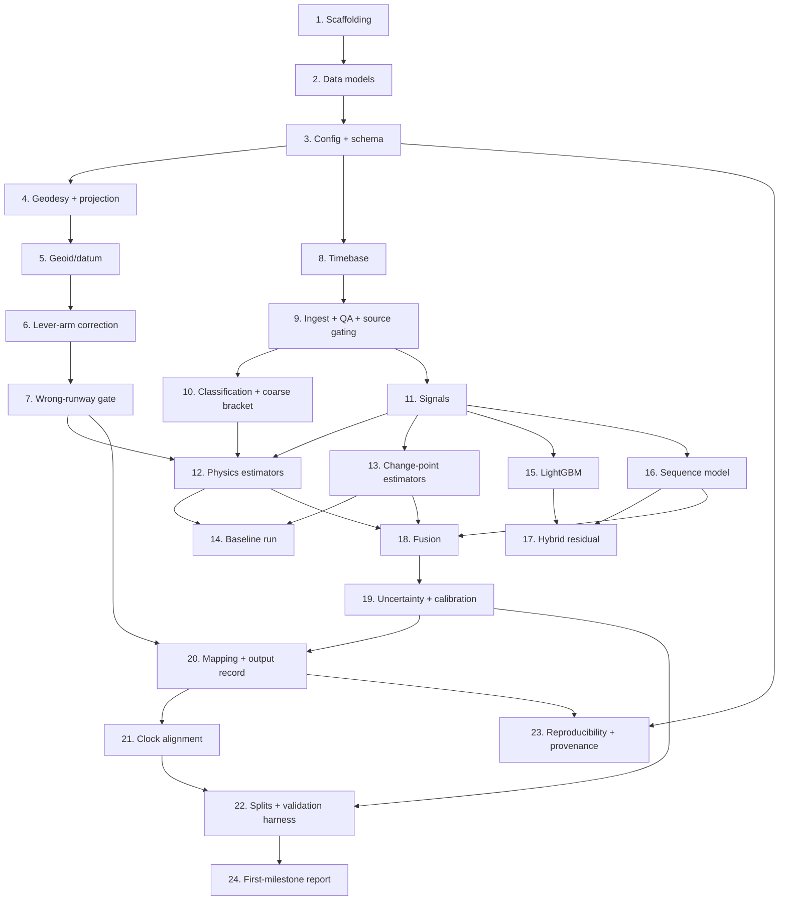

# Implementation Plan

## Overview

This plan turns the [requirements](requirements.md) and [design](design.md) into incremental, test-driven coding tasks. It follows the staged build order from the [README](../../../README.md): geometry and datum first (the parts that silently bias everything), then bracketing/classification, then estimators from physics → change-point → learned, then fusion, calibration, and the full validation harness.

Each task is independently shippable and builds on the previous one. Property references (P1–P23) map to the correctness properties in the design; requirement references (e.g., 11.4) map to acceptance criteria.

Guiding rules baked into every task:
- All internal computation in SI units (m, m/s, s, rad); convert to feet/knots only at the output boundary (Units Convention).
- No estimation-affecting numeric literal in source code; everything tunable lives in config (Req 20).
- Write tests alongside (or before) implementation; geometry/timebase tasks are test-first because errors there are invisible downstream.

## Task Dependency Graph



Tasks within the same wave have no dependencies on each other and may be executed in parallel; each wave depends on the waves before it.

```json
{
  "waves": [
    { "wave": 1, "tasks": ["1"], "description": "Project skeleton and tooling" },
    { "wave": 2, "tasks": ["2"], "description": "Data models" },
    { "wave": 3, "tasks": ["3"], "description": "Config loader, schema, validation" },
    { "wave": 4, "tasks": ["4", "8"], "description": "Geodesy/projection and timebase (independent branches)" },
    { "wave": 5, "tasks": ["5", "9"], "description": "Geoid/datum unification and ingest/QA/source gating" },
    { "wave": 6, "tasks": ["6", "10", "11"], "description": "Lever-arm correction, classification/bracket, signals" },
    { "wave": 7, "tasks": ["7", "12", "13", "15", "16"], "description": "Wrong-runway gate, physics + change-point + learned estimators" },
    { "wave": 8, "tasks": ["14", "17", "18"], "description": "Baseline run, hybrid residual, fusion ensemble" },
    { "wave": 9, "tasks": ["19"], "description": "Uncertainty quantification and calibration" },
    { "wave": 10, "tasks": ["20"], "description": "Time->position mapping and output record" },
    { "wave": 11, "tasks": ["21", "23"], "description": "Clock alignment, reproducibility/provenance" },
    { "wave": 12, "tasks": ["22"], "description": "Grouped splits and validation harness" },
    { "wave": 13, "tasks": ["24"], "description": "First-milestone validation report" }
  ]
}
```

## Tasks

### Stage 0 — Project scaffolding and configuration

- [x] 1. Set up the project skeleton and tooling
  - Create the `tdz/` package tree: `io/`, `bracket/`, `timebase/`, `signals/`, `geo/`, `estimators/{physics,changepoint,learned}/`, `fusion/`, `validation/`, `config/`, `tests/`.
  - Configure `pyproject.toml` with the stack from the README (Python 3.11+, NumPy/SciPy/pandas, `pyproj`, `ruptures`, `filterpy`, `scikit-learn`, `lightgbm`, PyTorch, `pytest`, `hypothesis`).
  - Add the pytest markers (`property`, `unit`, `integration`, `validation`, `slow`) and Hypothesis settings (`max_examples = 100`, deadline) from the design Testing Strategy.
  - _Requirements: 15.3_

- [x] 2. Implement the data models (dataclasses)
  - Define `TDEstimate`, `FlightRecord`, `RunwayReference`, `LeverArm`, `FusedEstimate`, `TouchdownResult`, `SourceCapability`, `AireonMessage`, `FR24Record`, `QARTruthRecord`, `ValidationMetrics`, and the `FailureReason` enum exactly per the design Data Models section.
  - Ensure every numeric field carries an explicit unit in its name or docstring; keep internal fields in SI and mark the output-boundary conversions.
  - _Requirements: 14.3, 14.4_

- [x] 3. Build the configuration loader, schema, and validation
  - [x] 3.1 Implement YAML config loading matching the design Configuration Schema (pipeline, timebase, signals, estimators, fusion, quality_gates, lever_arms, geodesy, vertical_crossing, sources, validation, output).
  - [x] 3.2 Implement schema validation that rejects wrong types, out-of-range values, and unknown estimator names at startup with a specific error naming the parameter and violated constraint; reject a lever-arm table with no entries.
  - [x] 3.3 Implement defaults resolution: missing parameters fall back to a defaults section and log a warning naming the parameter and applied default; record the fully resolved config for reproducibility.
  - [x] 3.4 Write property test P12 (random invalid mutations → rejected with correct message) and unit tests for defaults/warning behavior.
  - _Requirements: 20.1, 20.2, 20.3, 20.4, 20.5; Property 12_

### Stage 1 — Geometry, datum, and mapping (test-first)

- [x] 4. Implement geodesy and runway centerline projection (`tdz.geo`)
  - [x] 4.1 Implement threshold-relative projection using geodesic / local tangent plane (ENU) math via `pyproj`, returning along-runway distance and lateral offset; never use naive Euclidean on raw lat/long. Use the landing/displaced threshold as origin with the signed convention (positive = past threshold in landing direction).
  - [x] 4.2 Write property test P1 (round-trip within 0.1 m for distance 0–6000 m, offset ±50 m) and a high-latitude geodesic-vs-Euclidean known-answer test.
  - [x] 4.3 Implement runway-reference validation rejecting missing/null/out-of-bounds fields (lat ±90, lon ±180, heading 0–360, elevation −500..10000 m, length 0..6000 m, width 0..100 m) with a field-identifying error, and emit `INVALID_RUNWAY_REF`.
  - [x] 4.4 Write property test P18 (random invalid runway inputs → rejected) and edge tests (heading 0°/360° wrap, distance exactly 0 at threshold).
  - _Requirements: 2.1, 2.2, 11.1, 11.3, 11.4, 11.5, 11.6; Properties 1, 18_

- [x] 5. Implement vertical datum unification (geoid correction)
  - Load the configured geoid model (EGM2008) and convert an MSL/orthometric runway elevation to HAE by adding the local undulation; tag the datum and never compare MSL elevation directly against HAE geometric altitude. Emit `DATUM_UNRESOLVED` when the datum/undulation cannot be resolved.
  - Write property test P19 (synthetic crossing with known undulation recovers correct height; MSL and HAE inputs agree after correction).
  - _Requirements: 11.1, 11.2; Property 19_

- [x] 6. Implement the pitch-resolved lever-arm correction
  - [x] 6.1 Apply the vertical offset V to the altitude-crossing target and shift along-runway position by exactly `X·cos θ + V·sin θ` using the per-type nominal pitch θ (pitch assumed, not measured); record in diagnostics that pitch was assumed.
  - [x] 6.2 Implement the class-median default for missing type entries (median of aircraft class, global median if class unknown), mark the estimate low-confidence with `MISSING_LEVER_ARM`, record the assumed values/class/pitch, and widen the distance CI to span the class lever-arm range. Never use a worst-case (largest-offset) default.
  - [x] 6.3 Write property test P2 (shift equals `X·cosθ + V·sinθ`, crossing target shifts by V) and P23 (missing type → class median, widened CI, low-confidence, no worst-case bias).
  - _Requirements: 2.3, 7.2, 7.3, 7.4, 7.5, 7.6; Properties 2, 23_

- [x] 7. Implement the wrong-runway lateral-offset gate
  - Flag `SUSPECTED_WRONG_RUNWAY` when lateral offset exceeds half runway width + configurable margin (default 50 ft); flag `OUT_OF_BOUNDS_POSITION` when along-runway distance exceeds runway length or is negative (still report the value).
  - Write property test P22 (parallel-runway-offset trajectory → suspected-wrong-runway set).
  - _Requirements: 2.4, 2.5; Property 22_

### Stage 2 — Timebase, ingest/QA, bracketing and classification

- [x] 8. Implement the timebase module (`tdz.timebase`)
  - [x] 8.1 Implement async-timestamp preservation: keep separate position and velocity timestamp arrays, never merge into one sample time.
  - [x] 8.2 Implement kinematic (dead-reckoning) interpolation that propagates position using velocity; fall back to linear positional interpolation and flag `DEGRADED_INTERPOLATION` when velocity is unavailable. Emit an explicit time-delta channel. Support both common-grid resampling and continuous-time strategies.
  - [x] 8.3 Write property test P3 (interpolation error < 30 ft at 120–150 kt for known offsets), P4 (async timestamps preserved, distinct-timestamp count conserved), and the synthetic straight-line known-answer test.
  - _Requirements: 8.1, 8.2, 8.3, 10.1, 10.2, 10.3, 10.4; Properties 3, 4_

- [x] 9. Implement ingest, source-capability gating, and QA (`tdz.io`)
  - [x] 9.1 Parse both source formats (Aireon async, FR24 co-timed), join runway/aircraft metadata, and build `FlightRecord`. Record the ADS-B source per estimate.
  - [x] 9.2 Apply per-source `SourceCapability` gating: disable geometric-altitude-dependent estimators when `has_geometric_altitude` is false, never substitute barometric altitude into a geometric crossing, and don't treat provider-interpolated samples as independent observations. Emit `GEOMETRIC_ALT_UNAVAILABLE`. Drive entirely from config so FR24 assumptions can be flipped.
  - [x] 9.3 Implement QA gates: deduplicate identical timestamps (within 0.1 s, keep last-received); exclude samples implying >1.0 g longitudinal, >0.5 g lateral, or >6°/s turn rate, logging counts/timestamps; reject flights below sufficiency thresholds with the matching reason code (`INSUFFICIENT_SAMPLES`, `NO_GROUNDSPEED`, `GAP_SPANS_TOUCHDOWN`, `EXCESSIVE_EXCLUSIONS`).
  - [x] 9.4 Write property tests P8 (dedup count/last-received), P9 (kinematic-gate exclusion), P13 (missing vertical rate still produces estimate), and P20 (no-geometric-altitude source excludes vertical estimators).
  - _Requirements: 8.4, 8.5, 8.6, 8.7, 8.8, 9.1, 9.3, 9.4, 9.5; Properties 8, 9, 13, 20_

- [x] 10. Implement trajectory classification and the coarse bracket (`tdz.bracket`)
  - [x] 10.1 Classify each trajectory as completed-landing, go-around, or touch-and-go from altitude/speed/track signatures; go-around → `GO_AROUND` no-touchdown result; touch-and-go → tagged (report-or-suppress per config); do not assume one landing per trajectory (document/handle multiple).
  - [x] 10.2 Form the flag-independent coarse bracket `[t_lo, t_hi]` from the on-ground flag (upper bound only) AND a flag-independent indicator (geometric-altitude descent toward runway elevation + ground-roll deceleration onset). Anchor the bracket to the first contact for bounces. Expose the bracket for all downstream quality gates.
  - [x] 10.3 Write property test P21 (go-around → no touchdown; bounce → first contact, not a midpoint) and validate classification against QAR-derived labels (confusion matrix).
  - _Requirements: 1.1, 1.2, 21.1, 21.2, 21.3, 21.4, 21.5, 21.6; Property 21_

### Stage 3 — Signals and physics / change-point baselines

- [x] 11. Implement the signals/feature module (`tdz.signals`)
  - [x] 11.1 Implement segmented (piecewise) regression directly on the raw groundspeed-vs-time series as the primary deceleration-regime estimate (breakpoint = regime transition), avoiding differentiate-then-detect.
  - [x] 11.2 Implement corroborating derivatives (deceleration, jerk) via Savitzky-Golay (poly order ≤ 3, window ≥ 5 samples) or a non-stationary/piecewise Gaussian process; emit GP posterior std for inverse-variance weighting; flag derivatives unreliable when < 5 valid samples in the window. Report the configured smoothing window in diagnostics.
  - [x] 11.3 Build feature channels (incl. distance-to-threshold and time-delta) for learned estimators.
  - [x] 11.4 Write derivative-quality known-answer test (analytical derivative → RMS error) and the QAR-vs-smoothed-deceleration RMS-discrepancy check harness.
  - _Requirements: 16.1, 16.2, 16.3, 16.4, 16.5, 16.6, 16.7_

- [x] 12. Implement physics estimators (`tdz.estimators.physics`)
  - [x] 12.1 Deceleration-knee estimator: piecewise groundspeed fit (2- or 3-segment), breakpoint = `t_td`, with aircraft-type priors on approach speed/deceleration; output fitted segments, breakpoint, residuals as diagnostics.
  - [x] 12.2 Vertical flare-crossing estimator: joint glideslope+flare fit over the extended region (~200–300 ft down to surface), curved flare term; operate in HAE with geoid-corrected runway elevation and antenna-to-gear height added to the crossing target; keep deterministic geoid correction separate from residual sensor-bias estimation (bias from high-approach samples only, never flare-region); disable for sources lacking geometric altitude; flag `INSUFFICIENT_FLARE_SAMPLES` when < 3 samples in the fit region.
  - [x] 12.3 IMM filter + RTS smoother: two modes (descending vs ground roll), mode-probability crossover = `t_td`, consuming async position/velocity natively; output mode probabilities, crossover sharpness, covariance at `t_td`.
  - [x] 12.4 Enforce the common `BaseEstimator`/`TDEstimate` contract and the on-ground-flag upper bound: clamp/discard any candidate `t_td` later than the transition; never output the transition time as `t_td`. Write property test P5.
  - [x] 12.5 Write the flare-starvation edge test (only 1 sample below 50 ft → extended-region fit, not failure) and the FR24-source test (vertical estimator excluded, estimate still produced from speed/position).
  - _Requirements: 5.1, 6.1, 17.1, 17.2, 17.3, 17.4, 17.5, 18.1, 18.2, 18.3, 18.4; Property 5_

- [x] 13. Implement change-point estimators (`tdz.estimators.changepoint`)
  - Implement PELT, CUSUM, and GLRT on the deceleration signal, plus a jerk-onset detector (uses jerk onset timing, never as sole basis for `t_td`). All emit the common contract and respect the on-ground upper bound.
  - _Requirements: 5.2, 16.3_

- [x] 14. Wire a physics+change-point baseline run and the naive baseline
  - Run stages 1–3 end-to-end on a synthetic/held-out slice; implement the naive "first on-ground sample position" baseline for side-by-side comparison; produce a preliminary distance-error distribution to surface the cadence-limited floor.
  - _Requirements: 12.8, 13.0_

### Stage 4 — Learned estimators

- [ ] 15. Implement the LightGBM window-feature estimator (`tdz.estimators.learned`)
  - Train gradient-boosted trees on engineered window features; output touchdown-time offset and a quantile pair for uncertainty; expose feature importances; emit the common contract.
  - _Requirements: 5.3_

- [ ] 16. Implement the TCN/BiLSTM sequence model
  - Train over the landing window using physics-derived channels + time-delta + static context (aircraft type/source embeddings) with soft Gaussian labels centered on QAR touchdown time; output per-timestep P(touchdown) → expected value `t_td` and distribution-width uncertainty; optional deep ensemble for epistemic uncertainty.
  - Implement the rare-type physics fallback: for aircraft types with < 50 QAR-labeled flights, use the physics estimator as primary (and omit a learned estimate); always include the physics anchor `t_td`/diagnostics in the record. Write property test P15.
  - _Requirements: 5.3, 6.2, 6.3, 6.4; Property 15_

- [ ] 17. Implement the optional hybrid-residual model
  - Train the learned model to predict the residual of a physics estimate rather than absolute time, keeping a physical backbone.
  - _Requirements: 5.3, 6.2_

### Stage 5 — Fusion and uncertainty calibration

- [ ] 18. Implement the fusion ensemble (`tdz.fusion`)
  - [ ] 18.1 Combine ≥3 estimator families (physics, change-point, learned) via calibrated stacking / weighted blend into a single `t_td` with a predictive interval; record contributing/excluded estimators per flight.
  - [ ] 18.2 Down-weight or exclude estimators reporting `sigma_t` above the confidence threshold or a failure diagnostic; give the on-ground flag zero weight; emit no-estimate (`ALL_ESTIMATORS_FAILED`) when all fail; flag `WIDE_CONFIDENCE_INTERVAL` when CI width exceeds threshold and `ESTIMATOR_DISAGREEMENT` on high variance.
  - [ ] 18.3 Write property tests P14 (high-sigma down-weighting) and P5 (fused `t_td` respects on-ground bound).
  - _Requirements: 5.4, 5.5, 5.6, 18.4; Properties 5, 14_

- [ ] 19. Implement uncertainty quantification and calibration
  - Produce 90% CIs for time (s) and distance (ft); widen CIs proportionally to gap duration / nominal cadence within ±30 s of touchdown; widen for missing-lever-arm and post-transition sample starvation; conformalize intervals on the calibration split to hit 85–95% empirical coverage; flag low-confidence rather than suppress when a reliable interval cannot be computed.
  - Write property tests P6 (CI validity: lower < point < upper, positive width) and P7 (gap-proportional widening).
  - _Requirements: 4.1, 4.2, 4.3, 4.4, 4.5, 9.2, 9.6; Properties 6, 7_

- [ ] 20. Implement time→position mapping and the full output record (`tdz.geo` + assembler)
  - Interpolate the trajectory at fused `t_td` to compute along-runway distance, lateral offset, and groundspeed at touchdown (50–220 kt, 0.1 kt resolution, from interpolation not nearest sample); propagate `t_td` uncertainty into speed CI; apply lever-arm correction; convert SI→feet/knots at this boundary only; assemble `TouchdownResult` with all confidence/diagnostic/provenance fields.
  - Write property test P17 (output completeness: exactly one confidence class; reason code present when not normal; all primary fields populated otherwise) and the end-to-end synthetic-flight integration test.
  - _Requirements: 2.1, 2.2, 3.1, 3.2, 3.3, 3.4, 14.1, 14.2, 14.3, 14.4; Property 17_

### Stage 6 — Validation, reproducibility, and reporting

- [ ] 21. Implement QAR clock alignment (`tdz.validation`)
  - Estimate per-flight QAR↔ADS-B offset by cross-correlating an overlapping kinematic series (groundspeed/along-track position), never on touchdown itself; detect within-flight drift and flag beyond a configurable bound; apply the offset to QAR timestamps for time-domain labels/metrics only; report the offset distribution (median, SD, p95); exclude flights exceeding the threshold (default 2 s) or with unreliable offsets from time-domain training/validation (`CLOCK_OFFSET_EXCEEDED`), retaining them for distance validation.
  - Write property test P16 (offset > 2 s → excluded and in flagged-flights report) and the synthetic known-offset recovery test.
  - _Requirements: 19.1, 19.2, 19.3, 19.4, 19.5, 19.6, 19.7; Property 16_

- [ ] 22. Implement grouped splits and the validation harness
  - [ ] 22.1 Implement the tail-grouped primary split plus disjoint calibration partition, and separate held-out-airport and held-out-runway evaluations (reported separately, not intersected). Write property test P10 (no tail leakage; calibration disjoint; held-out airport/runway absent from training).
  - [ ] 22.2 Compute clock-independent along-runway distance truth from QAR lat/long; compute metrics (signed/absolute distance error, RMSE, median, IQR, p95/p99 absolute, p95 long-side signed, time error) stratified by aircraft type, source, airport, approach-speed band (≥30 flights/stratum); report system vs naive baseline side-by-side.
  - [ ] 22.3 Implement cross-source evaluation (train on one source, test on the other, both directions) using flights present in both feeds to isolate the source effect; report accuracy drop vs same-source.
  - [ ] 22.4 Implement coverage assessment (90% CI → 85–95%) on the calibration split; characterize and report the cadence-limited error floor; flag below-target strata (≥200 flights) against the provisional targets without hard-failing.
  - _Requirements: 4.3, 4.4, 12.1, 12.2, 12.3, 12.4, 12.5, 12.6, 12.7, 12.8, 12.9, 12.10, 13.0, 13.1, 13.2, 13.3, 13.4, 13.5; Property 10_

- [ ] 23. Implement reproducibility and provenance
  - Propagate a single master seed to all stochastic components; produce bit-identical outputs for physics/change-point/LightGBM/geometry fields; for the neural model reproduce within a documented tolerance or bit-identically in an explicit deterministic mode (record the mode); record data version, git commit, model artifact hash, resolved config, Python and key library versions with every output batch.
  - Write property test P11 (deterministic reproducibility) and integration tests for both source formats on identical trajectories.
  - _Requirements: 15.1, 15.2, 15.3; Property 11_

- [ ] 24. First-milestone validation report
  - Run stages 1–3 on a held-out QAR slice, produce the distance-error distribution and baseline comparison, and confirm the cadence-limited floor — establishing how much room the learned models have to add before ratifying the provisional accuracy targets.
  - _Requirements: 13.0, 12.8_

## Notes

- The dependency graph above is the build order: Stage 1 geometry/datum tasks (4–7) are deliberately test-first because projection, geoid, and lever-arm errors bias every downstream estimate invisibly.
- Tasks 15–17 (learned estimators) depend on the signal/feature work in task 11 and on labeled data prepared via clock alignment (task 21) for time-domain training; distance-domain validation stays clock-independent.
- Accuracy targets in Requirement 13 are provisional until task 24 characterizes the cadence-limited error floor; treat them as reporting targets, not pass/fail gates, until ratified.
- Every task keeps internal computation in SI units and externalizes tunable values to config per Requirement 20; the SI→presentation conversion happens only at task 20's output boundary.
